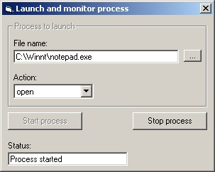



## Multithreading to monitor shelled process

### Description

To monitor a shelled process in order to recieve notification as to when the shelled process is finished, while maintaining the main thread free for use.
 
### More Info
 

             |
---                |---
**Submitted On**   |2003-01-20 14:58:28
**By**             |[Jose Ramirez](https://github.com/Planet-Source-Code/PSCIndex/blob/master/ByAuthor/jose-ramirez.md)
**Level**          |Intermediate
**User Rating**    |4.9 (39 globes from 8 users)
**Compatibility**  |VB 5\.0, VB 6\.0
**Category**       |[Complete Applications](https://github.com/Planet-Source-Code/PSCIndex/blob/master/ByCategory/complete-applications__1-27.md)
**World**          |[Visual Basic](https://github.com/Planet-Source-Code/PSCIndex/blob/master/ByWorld/visual-basic.md)
**Archive File**   |[Multithrea1532221202003\.zip](https://github.com/Planet-Source-Code/jose-ramirez-multithreading-to-monitor-shelled-process__1-42596/archive/master.zip)

### Source Code

<h2>A Few Quick Notes</h2>

1. This is not an article, but it is the only way I know of submitting something decently formatted.

2. The category for this article is "Complete Applications" since I could not find a better category.

3. This application was developed and compiled using Visual Basic 5, SP3, and has not been tested under VB6. I hope, though, it will work fine once it is compiled.

<h2>Introduction</h2>

This is a small program that demonstrates how to shell out a process via ShellExectuteEx and monitor it for completion (termination) by using a worker thread.

VB has a lot of limitations when it comes to multithreading. For example, in order to pass data to the thread procedure, you must ensure that data is allocated throughout the lifetime of the thread because VB lacks of pointers. In this example, I use form-level variables to store thread data, but as usual, you can use the Heap* API functions to allocate memory and pass pointers to the thread, so the thread can release the memory once it is done using the data.

In C++ it would be easy:

<code>typedef struct tagThreadData 
&nbsp;&nbsp;&nbsp;&nbsp;{ 
&nbsp;&nbsp;&nbsp;&nbsp;&nbsp;&nbsp;&nbsp;&nbsp;//blah blah all struct members 
&nbsp;&nbsp;&nbsp;&nbsp;} ThreadData; 
 
Then, you use the new operator in code: 
 
ThreadData* pData = new ThreadData; 
 
You then pass pData to CreateThread API and that is it. The thread could then do a "delete lpThreadData;" so the main thread does not have to worry about it.</code>

See? In C++, the thread can delete the data once it is not needed so the main thread does not have to worry about maintaining the data. This, sadly enough, is not the case in this sample program, although, as I said before, you could use the Heap* functions to simulate what C++ can do natively.

The other big limitation of VB when it comes to multithreading is the inability to debug, or run from the IDE.

Although I was able to use the IDE to test the waiting, the program crashed while using the stop process button. So, in order to be really sure the program works, you must compile. And if you need to track a bug, you must set a log file or something similar into the compiled executable.

<h2>How this Program Works</h2>

Unlike its implementation, the principle is simple: Shell out a process, then use a process handle and wait on it in a separate thread, so the main thread (the VB user interface) can be used in the meantime.

<h3>COM Rules and Memory Lifetime</h3>

As far as I can tell, all VB programs are apartment-threaded, so any use of COM objects outside the main thread require marshaling. This is something I was not prepared to face at the moment, so I figured out a way of communicating with the main thread differently: SendMessage. The data passed to the worker thread is:

<code>Type ThreadDataType 
&nbsp;&nbsp;&nbsp;&nbsp;hwnd As Long 
&nbsp;&nbsp;&nbsp;&nbsp;hWndEdit As Long 
&nbsp;&nbsp;&nbsp;&nbsp;ExeName As Long 
&nbsp;&nbsp;&nbsp;&nbsp;Action As Long 
End Type</code>

<b>hwnd:</b> The window handle of the main form. This form will be the owner of any message boxes produced by the system while trying to shell out the specified process.

<b>hWndEdit</b> The window handle of the textbox used to display the status of the shelled process. This is where the actual communication between threads occur. By using SendMessage with WM_SETTEXT, the Change event of the textbox is fired, and therefore, the main thread gets informed of the state of the process. Well, the Change event and a Event object used as a boolean value. This is how I avoided marshaling COM interface pointers.

<b>ExeName:</b> A pointer to an ANSI null-terminated string containing the filename to shell out. This corresponds to VarPtr(arrExe(0)) in the LaunchApp() procedure in form1.

<b>Action:</b> A pointer to an ANSI null-terminated string containing the action to perform on the specified file. Corresponds to VarPtr(arrAction(0)).

 
The last two members are the "hack" to ensure the parameters will be available for the thread to use. Two strings must be passed, but since they must be ANSI and VB strings are Unicode, I convert the string unsing StrConv(vbFromUnicode) and store the result in a byte array. Note the explicit addition of the null char. This is completely necessary. Then, I pass the pointer of the first element, as all array elements are contigous in memory.

<h3>Synchonization Objects</h3>

A multithreaded project that does not synchronize the threads is guaranteed to fail, especially in VB, which was not designed for multithreading the way we all want to use them.

This project uses three synchronization objects of type Event: The first one, hEventExit, is used to signal the worker thread that the main thread wants/needs to terminate the thread. The second one, hEventNoProcess is used as a boolean flag in the Change event of the tbStatus textbox to see if there is a current process being monitored. The worker thread is in charge of signaling this event. Finally, hEventNoMessages is used to prevent deadlocking of the two threads. This one require a little more explanation.

The worker thread waits on the main thread implicitly when using SendMessage to set the tbStatus textbox's text. SendMessage API does not return until the message has been processed. Furthermore, PostMessage cannot be used because lParam must be set to a pointer. Therefore, if the main thread waits on the worker thread to find out when its execution finishes, you will have a deadlock situation the moment SendMessage is used in the worker thread. This is why the procedure KillExe in form1 signales the hEventNoMessages handle prior of signaling of hEventExit: To ensure the worker thread will NOT use SendMessage. You can see the worker thread's code for full undertanding.

<h2>Final Notes</h2>

Although this program seems to be quite effective in achieving its goal, I in no way say this is the final and best way. This is just a way, especially because this is my first multithreaded project in VB.

I encourage everyone to download and test the program in order to critize it and let me know of better ways to achieve multithreading. I thank you all for reading.

Finally, let me inform you that you will find a file inside the zip called project1.exd. This file is the executable file compiled in VB5, just in case VB6 fails and you want to see the program works. Just rename the file to project1.exe.

